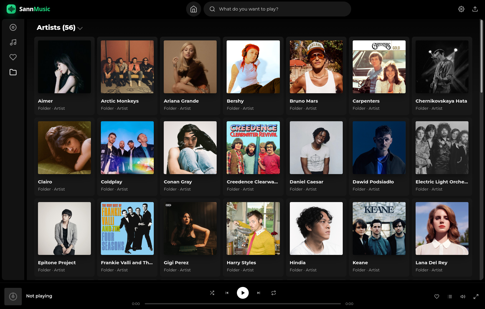
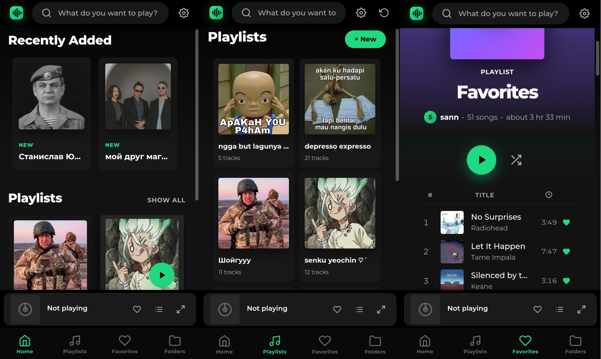

# SannMusic

A self-hosted, folder-based music streaming server wrapped in a decluttered, Spotify-like UI — built as a lightweight alternative to Navidrome and Gonic.

<p align="center">
  
  <br><em>Desktop: Folder view with collapsible Artists/Albums</em>
</p>

<p align="center">
  
  <br><em>Mobile: Home · Playlists · Favorites</em>
</p>

## About

SannMusic was created as an alternative to Navidrome and Gonic self-hosting music streaming servers. It offers folder-based music browsing with a decluttered Spotify-like UI for ease of use and familiarity, and is equipped with the [LRCLIB](https://lrclib.net/) API for lyrics.

All music in the library is hosted by [sannserver](https://music.trisandrean.web.id) from decentralized sources. This project was developed as an alternative to mainstream music streaming to boycott Spotify, which is currently targeted by the BDS Movement over the CEO's military tech investments, partnerships with complicit companies, and low artist payouts.

## Features

- 📁 **Folder-based library** — browse and stream directly from your own file structure, no forced metadata schema
- 🎧 **Spotify-like UI** — decluttered player with collapsible sidebar, full-screen mode, and mobile bottom nav
- 📝 **Synced lyrics** via the LRCLIB API with local disk cache
- ❤️ **Favorites & playlists** — per-user, server-side persistence with reorder support
- 🔄 **On-the-fly transcoding** — FLAC → Opus/AAC/MP3 with auto bitrate based on connection type
- 📱 **PWA support** — installable, offline-capable via service worker
- 🔐 **Multi-user auth** — pbkdf2-hashed passwords, admin controls, session management
- 🎵 Wide format support via `music-metadata`, `node-id3`, and `flac-metadata`
- 🗄️ Lightweight SQLite backend (`better-sqlite3`) — no heavy database server required

## Tech Stack

- **Backend:** Node.js, Express
- **Database:** SQLite (`better-sqlite3`)
- **Metadata parsing:** `music-metadata`, `node-id3`, `flac-metadata`
- **Transcoding:** `ffmpeg` (FLAC → Opus/AAC/MP3)
- **Uploads:** `multer`
- **Frontend:** Vanilla JS, HTML, CSS
- **PWA:** Service Worker + Web App Manifest
- **Lyrics:** [LRCLIB API](https://lrclib.net/)

## Getting Started

### Prerequisites

- Node.js (LTS recommended)
- A folder of music files (MP3/FLAC) to serve as your library

### Installation

```bash
git clone https://github.com/trisanap/sannmusic.git
cd sannmusic
npm install
```

### Running

```bash
node server.js
```

The server will start and serve the app — open it in your browser to start browsing your library.

### Running as a systemd service (self-hosted / always-on)

A sample unit file is included at [`sannmusic.service`](./sannmusic.service). Copy it to `/etc/systemd/system/`, adjust the paths/user as needed, then:

```bash
sudo systemctl daemon-reload
sudo systemctl enable --now sannmusic
```

## Project Structure

```
sannmusic/
├── server.js          # Express server entry point
├── app.js             # Frontend app logic
├── db.js              # SQLite database layer
├── styles.css         # UI styling
├── index.html         # App shell
├── sw.js              # Service worker (PWA)
├── manifest.json      # PWA manifest
├── package.json       # Dependencies
├── .gitignore
├── hidden.json        # Hidden/excluded folders config
├── icons/             # PWA icons
├── ref/               # Reference assets
└── sannmusic.service  # systemd unit file
```

## Roadmap / Ideas

- [ ] Dark/light theme toggle
- [ ] Drag-and-drop playlist reorder in UI
- [ ] Album art fetching from external sources

## License

© 2026 Trisan Andrean Putra

## Links

- Repo: [github.com/trisanap/sannmusic](https://github.com/trisanap/sannmusic)
- App: [sannmusic](https://music.trisandrean.web.id)
